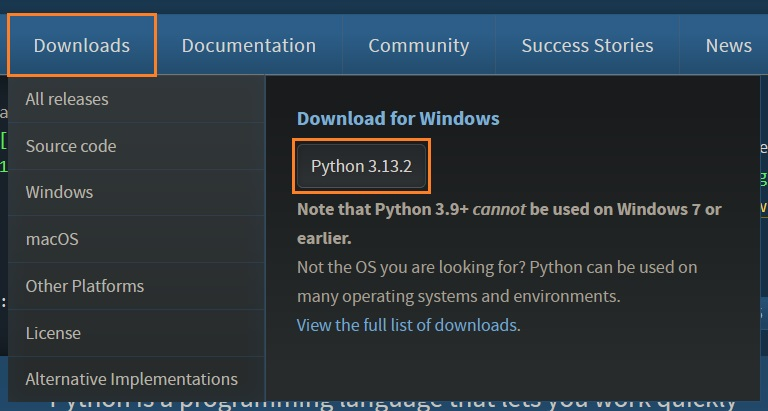
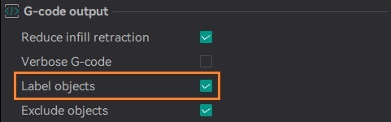
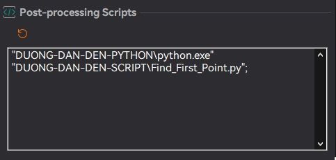
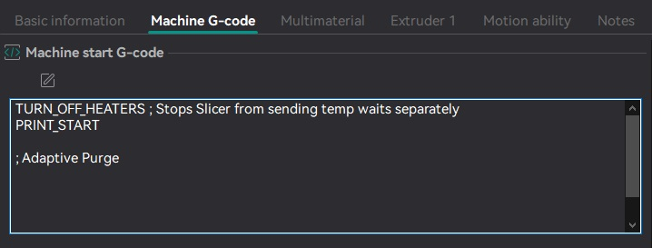
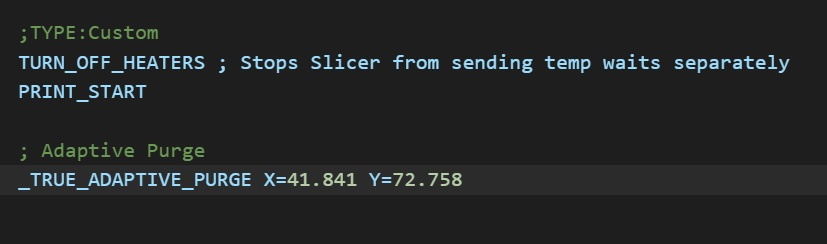
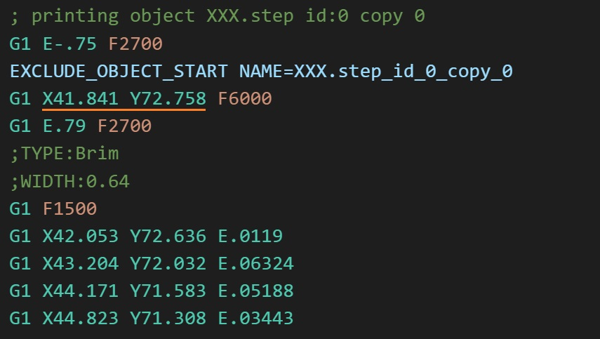
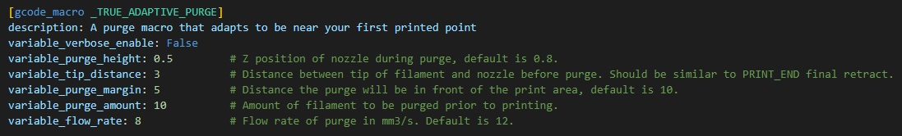

<h1 align="center">
    TRUE ADAPTIVE PURGE
</h1>

<p align="center">
  <a href="#MÔ-TẢ-SƠ-BỘ">MÔ TẢ</a> •
  <a href="#QUY-TRÌNH-HOẠT-ĐỘNG">QUY TRÌNH</a> •
  <a href="#YÊU-CẦU-CẦN-THIẾT">YÊU CẦU CẦN THIẾT</a> •
  <a href="#HƯỚNG-DẪN-CÀI-ĐẶT">CÀI ĐẶT</a> •
  <a href="#SỬ-DỤNG">SỬ DỤNG</a> •
  <a href="#CÁC-LỖI-THƯỜNG-GẶP">LỖI THƯỜNG GẶP</a> •
  <a href="#CREDITS">CREDITS</a>
</p>

# MÔ TẢ SƠ BỘ

* Macro cho [Klipper](https://github.com/Klipper3d/klipper/), dựa trên [KAMP](https://github.com/kyleisah/Klipper-Adaptive-Meshing-Purging/) để tạo `Purge-Line` tùy biến theo đối tượng in.

* Với KAMP, điểm Purge sẽ được tính toán dựa trên vùng sẽ in và đặt điểm Purge ở phía trước hoặc bên trái cạnh vùng in. 
    
    Như vậy sẽ có trường hợp (giả sử), điểm đặt Purge được tính tại phía trước vùng in nhưng điểm bắt đầu lại ở phía sau, làm cho sau khi Purge, đầu in sẽ phải di chuyển một đoạn (có thể sẽ rất dài tùy thuộc vào đối tượng in) để tới điểm bắt đầu in. Điều này có thể tạo nên tơ, hoặc là đầu in trong quá trình di chuyển tiếp tục nhỉ ra nhựa.
    
* Macro này sẽ kết với đoạn mã python thiết lập cùng phần mềm slicer giúp tìm được điểm bắt đầu in (điểm mà đầu tiên trong quá trình in sẽ bắt đầu đùn nhựa ra).

    Giúp cho đường `purge-line` được sát nhất có thể với điểm bắt đầu in, giảm đi khoảng cách đầu in phải di chuyển từ lúc Purge đến lúc bắt đầu in,

    Giúp giảm tình trạng tơ (stringing) sau khi purge (nhất là với các loại nhựa có độ nhớt cao (high viscosity) như là PETG).

# QUY TRÌNH HOẠT ĐỘNG

1. Đầu tiên phần mềm slỉcer vẫn hoạt động như bình thường vào tạo file gcode.

2. Sau đó trong quá trình lưu file .gcode (hoặc gửi file qua máy in), script `Find_First_Point.py` sẽ tự động được gọi lên và tìm điểm đầu tiên mà file sẽ in.<br>
Điểm này sẽ được xác định bằng cách tìm đoạn code đầu tiên có dạng `G1 X??? Y??? F???` trong file .gcode được slicer tạo ra.

3. Lúc này thì script sẽ tự động trích xuất tọa độ X-Y của điểm tìm được và chèn một đoạn mã `_TRUE_ADAPTIVE_PURGE X=xxx Y=yyy` vào đoạn code sau khi máy in hoàn tất công đoạn chuẩn bị (làm nóng đầu in, bàn, home...), với `xxx` và `yyy` là tọa độ của điểm tìm được.
    > NOTE: vị trí chèn code sẽ được xác định bằng đoạn mã  `; Adaptive Purge` đã được định vị sẵn (xem phần hướng dẫn cài đặt Slicer)

4. Lúc này file .gcode sẽ được lưu (hoặc chuyển qua trực tiếp cho máy in). 
5. Về phía máy in khi nhận được lệnh in file.<br>
Sau khi hoàn tất các giai đoạn chuẩn bị định sẵn (gia nhiệt, làm sạch đầu in...) và trước khi file in bắt đầu, macro `TRUE_ADAPTIVE_PURGE` sẽ được gọi.<br>
Lúc này macro sẽ dựa vào điểm in đầu tiên (đã xác định bằng script trên) sẽ tính toán vị trí gần nhất (nhưng vẫn nằm ngoài khu vực in)
    * Cách thức xác định vùng in sẽ giống với [KAMP](https://github.com/kyleisah/Klipper-Adaptive-Meshing-Purging/) macro. Đó là sẽ dùng đối tượng `EXCLUDE_OBJECT` mà slicer định vị trong file in.

        >NOTE: Cách thức này đối với đối với đối tượng in vuông vức thì rất tốt, nhưng với những đối tượng hình thù đa dạng (hoặc in nhiều đối tượng cùng lúc nhưng không xếp ngay ngắn) thì sẽ không hiệu quả.<br>
        Vì macro sẽ khoanh vùng tổng thể tất cả đối tượng in có trong file và tạo một hình vuông (nhiều trường hợp là hình chữ nhật) bao phủ hết tất cả đối tượng, cho nên một số trường hợp máy vẫn tính là trong vùng in nhưng không thực sự có đối tượng.<br>
        Sau này sẽ xem xét cải tiến hơn về việc tìm vùng in.

    * Sau khi xác định được vùng sẽ in, macro sẽ check xem từ điểm in đầu tiên về các cạnh ngoài vùng in, đâu là phía ngắn nhất (nhưng vẫn có đủ chỗ để in "purge-line").<br>
    Giả sử khi xác định là chiều trục X sẽ gần nhất nếu in purge-line, nhưng do quá gần với cạnh bàn in nên sẽ chuyển sang cạnh trục Y gần thứ hai.

        >NOTE: Cách chọn này nếu về phía trục X và Y đều quá gần cạnh bàn in (đối tượng in quá lớn, không đủ chỗ để purge) thì quá trình Purge sẽ được bỏ qua.<br>
        Trên console sẽ có báo `[PURGE SKIPPED] Purge Area to CLOSE to the edge`
    * `Purge-Line` sẽ in là một đoạn thẳng 10mm với một lượng nhựa lớn để làm sạch đầu in (về phần này thì sẽ tương tự như khi dùng KAMP).<br>
    Và tương tự như KAMP, các thông số có thể tùy biến tại Macro.

    * Sau khi in xong Purge-Line, đầu in sẽ di chuyển nhanh đến điểm bắt đầu file in (với tốc độ tối đa của máy in để tránh các sợi tơ).<br>
    Sau đấy file in sẽ tiếp tục như bình thường.

    >NOTE: Các bước kể trên chỉ để giải thích cách thức mà script và macro hoạt động.<br>
    Thực tế ngoài việc cài đặt các thông số lúc đầu, thì quá trình sẽ hoàn toàn tự động và quá trình xử lý file cũng rất nhanh nên sẽ không khác gì với trước khi dùng script.

# YÊU CẦU CẦN THIẾT

1. Vào trang [Python](https://www.python.org/), tải và cài đặt (nếu chưa có).
    <p align="center">
    
    </p>

2. Trong file `moonraker.conf` 
    * "<i>enable_object_processing</i>" được đặt là `True`, hoặc có thể thêm dòng dưới đây nếu chưa có:
  
    ```yaml
    [file_manager]
    enable_object_processing: True

    ```
3. `[exclude_object]` được thiết lập trong file `printer.cfg`.

4. Vẫn trong file `printer.cfg`, ở mục `[extruder]`.<br>
    * "<i>max_extrude_cross_section</i>" phải được set ít nhất là `5`. <br>
    > Note: Nếu chưa có mục "max_extrude_cross_section" thì có thể thêm vào.

# HƯỚNG DẪN CÀI ĐẶT
1. Đầu tiên tải file `Find_First_Point.py` về, đây là file script sẽ dùng để đọc gcode.

2. Thiết lập cho phần mềm Slicer.<br>
    <i>(ở đây mình sử dụng `Orca Slicer` nhưng với ai sử dụng Prusa Slicer thì cũng gần như tương tự)</i>

    * Ở bảng chỉnh thông số in, vào tab `OTHER`
    * Đầu tiên là tích vào `Labeling objects` nếu chưa được tích.
        
        <br>
        <p align="center">
        
        </p>

        <p align="center"> <i> Thiết lập trong Orca Slicer.</i></p>

    * Cũng trong bảng `OTHER`, kéo xuống dưới ở mục `Post-Processing Scripts`, điền vào đường dẫn tới file `Python.exe` và `Find_First_Point.py`:

        ```
        "DUONG-DAN-DEN-PYTHON\python.exe" "DUONG-DAN-DEN-SCRIPT\Find_First_Point.py";
        ```

        > **Note:** chú ý phải có dấu (") hai đầu và phải có đoạn cách giữa hai đường dẫn để phần mềm có thể đọc được.<br>
        > File `Python.exe` có thể tìm thấy ở thư mục cài hoặc thường sẽ nằm trong đây `%USERPROFILE%\AppData\Local\Microsoft\WindowsApps`, dán vào windows explorer để tìm.

        <br>
        <p align="center">
        
        </p>

    <p align="center"> <i> Thiết lập script trong Orca Slicer.</i></p>

    * Mở bảng thiết lập máy in và vào tab `Machine G-code`.

        Ở mục `Machine start G-code` thêm dòng `; Adaptive Purge` vào dưới cùng, (Trong hình mình có mỗi PRINT_START nhưng nếu mọi người có nhiều hơn thì cũng cho dòng `; Adaptive Purge` vào dưới cùng)

        <br>
        <p align="center">
        
        </p>
    
        Nên chú ý có dấu `;` phía trước để máy in sẽ không đọc mà bỏ qua.<br>
        Script sẽ dùng đoạn này như mốc để xác định đâu là đoạn code sau giai đoạn chuẩn bị của máy in (làm nóng, home, làm sạch đầu in...) và trước khi phần in thực sự bắt đầu.<br>

        > **Note:** Mình đã thử tìm một số điểm làm mốc khác để đơn giản hơn giai đoạn thiết lập script nhưng phần đầu trước khi in này sẽ thay đổi nhiều tùy vào nhiều thết lập trong slicer nên để chắc chắn chính xác đoạn cần chèn thên script thì tạo một mốc đặc trưng như thế này sẽ là cách tối ưu.<br>

    * Cuối cùng.<br> 
    Sau khi thực hiện các công đoạn cài đặt thì nhớ SAVE lại để dùng sau này.

3. Thiết lập cho máy in.

    * Copy nội dung trong file `TRUE_ADAPTIVE_PURGE.cfg` và paste vào file `printer.cfg` (hoặc file nào mọi người dùng để lưu macro thì dán vào đấy)<br>
    * Hoặc có thể tải cả file về và tạo một mục `[include TRUE_ADAPTIVE_PURGE.cfg]` trong file `printer.cfg`.

    * Khởi động lại `klipper` để load các file mới.
    
# SỬ DỤNG

* Sau khi cài đặt thì quá trình sử dụng không có khác gì so với trước (vì toàn bộ sẽ tự động chạy).

* Vì quá trình sẽ tự động nên có thể script lỗi mà không có thông báo (hoặc thiết lập không đúng đẫn đến không chạy được). Nên sau khi slice thử file, lưu file .gcode và mở bằng một phần mềm chỉnh sửa text bất kì (vd. notepad), nếu có dòng `_TRUE_ADAPTIVE_PURGE X=xxx Y=yyy` phía dưới dòng `; Adaptive Purge` (như hình) thì tất cả đều ok.

<p align="center">

</p>

* Kéo xuống dưới một đoạn và check tiếp, dòng đầu tiên `G1 X??? Y???` xuất hiện, thông số `X` và `Y` có giống với phía trên không.

<p align="center">

</p>

* Về phía máy in, khi in sẽ có tạo một đoạn Purge-Line nhỏ tầm 10mm cạnh đối tượng in, và ở `Console` (vd như ở đây mình dùng Mainsail) sẽ có dòng log như này.

<p align="center">

</p>

* Giải thích về các thông số có thể tùy chỉnh trong Macro.
    - 
    - Về cơ bản các thông số sẽ giống với KAMP.

    <p align="center">
    
    </p>
    
    - `verbose_enable`: xuất log ra cửa sổ console
    - `purge_height`: cao độ đầu in khi in Purge-Line.
    - `tip_distance`: khoảng cách giữa đầu nhựa và đầu in. Thường sẽ thiết lập bằng khoảng cách sợi nhựa sẽ rút lại lúc kết thúc file in trước.
    - `purge_margin`: khoảng cách giữa điểm in Purge-Line và đối tượng in.
    - `purge_amount`: chiều dài sợi nhựa sẽ dùng để Purge.
    - `flow_rate`: mức độ lưu lượng khi purge. Càng nhiều thì đầu in sẽ càng sạch (theo lý thuyết)

# CÁC LỖI THƯỜNG GẶP

* ...

# CREDITS

* [KAMP](https://github.com/kyleisah/Klipper-Adaptive-Meshing-Purging/) - phần lớn macro này được dựa trên KAMP.
* [Klipper](https://github.com/Klipper3d/klipper/) - macro phần mềm chạy trên nền Klipper Firmware.
* [OrcaSlicer](https://github.com/SoftFever/OrcaSlicer) - đã test trên Orca Slicer 2.2.0